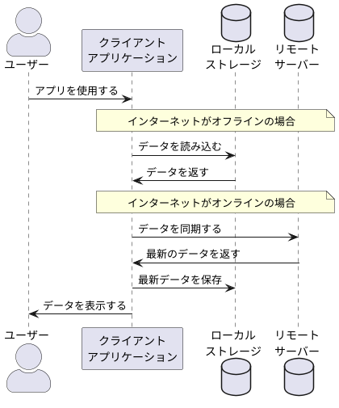

## 【Rails】関連先モデルの一覧を取得
```ruby
Customer.reflect_on_all_associations.map(&:name)
```

---

## 【Vue】毎回忘れる`v-slot`ディレクティブ
```html
<main-container>
  <template #header>
  <!-- v-slot:header の省略 -->
    <breadcrumb />
  </template>
  <template #default>
    <main-frame></main-frame>
  </template>
  <template #footer>
    <button>Close</button>
  </template>
</main-container>
```

- templateタグの親要素が元となるコンポーネントで、そこでslotが定義されている(この場合、`<main-container>`)
- 「このtemplateはどこに挿入されるんだ？」が気になったら親要素の定義ファイルを見に行く(この場合、`main-container.vue`みたいなファイル)

```html
<!-- main-container.vue -->

<section>
  <div>
    <!-- @slot ヘッダー -->
    <slot name="header" />
  </div>
</section>

<section>
  <!-- @slot メインコンテンツ -->
  <slot />
</section>

<section>
  <div>
    <!-- @slot フッター -->
    <slot name="footer" />
  </div>
</section>
```

> name を持たない <slot> アウトレットは、暗黙的に "default" という name を持つものとされます。

https://ja.vuejs.org/guide/components/slots

---

## 【Web】オフラインモードってどうなってるの？
1. サーバーから取得したデータをブラウザのローカルストレージに保存
2. オフラインでアクセスした場合はローカルストレージのデータを表示
3. 次回オンラインアクセス時に、ローカルストレージのデータを更新(同期)


- 最後にサーバーと通信した時点でのデータが利用可能。オフラインの間に他のユーザーやプロセスによってデータが更新されていても反映されない。
- オフラインではサーバーと通信できないため、POSTリクエスト（情報の更新）は行えない。

### memo
- LocalStorageのデータは`同一オリジン(ドメイン、プロトコル、ポート)`のページで共有される
- Cookieより容量が大きい

---

## 【AI】シーケンス図の作り方
- プロンプトに「シーケンス図をPlantUML形式で書いてください」と加えると生成してくれる
- https://www.plantuml.com/plantuml にコピペして確認する


<details><summary>生成される画像</summary>


</details> 
