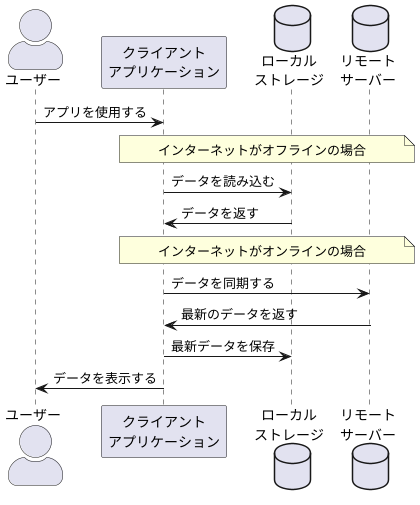

## 【JS】async関数は常にPromiseを返す
**OK**
```ts
// async関数の中で、awaitを使って解決済みの値(value)を参照している
async function asyncFunction() {
  const value = await getPromiseFunction(args)
  console.log(value)
}
// async関数を直接呼び出している
asyncFunction()
```
**NG**
```ts
const asyncFunction = async () => {
  const value = await getPromiseFunction(args)
  return value
}
// async関数の返り値を参照している。async関数そのものはPromiseオブジェクトを返すので、valueの値が解決された値だとしても最終的にPromiseオブジェクトが返る
console.log(asyncFunction())
```

---

## 【コードリーティング】コールバック関数、Promise、PapaParse
### 元コード
```ts
const getEmployeeNumbersInCsv = (file: File): Promise<string[]> =>
  new Promise((resolve, reject) => {
    Papa.parse(file, {
      complete: (results) => {
        // TODO: 社員番号を抽出する処理
        resolve(employeeNumbers)
      },
      error: (error) => reject(error),
    })
  })

```
### コードリーティング後
```ts
// 返り値が1つの式のみなので {} を省略している (コールバック関数がたくさん書かれているけど式自体は new Promise の1つ)
const getEmployeeNumberFromCsv = (file: File): Promise<string[]> =>
  // new Promise((resolve, reject) => { ... })
  // コンストラクター。Promiseオブジェクトを生成する。resolve/reject の2つのコールバック関数を持つ。
  new Promise((resolve, reject) => {
    // Papa.parse(file, { ... })
    // PapaParseライブラリに含まれる関数。CSVファイルの内容を解析する。fileオブジェクトとPapaParseのオプションオブジェクト(https://www.papaparse.com/docs#config)
    Papa.parse(file, {
      // complete: () => { ... }
      // completeというプロパティ(キー)に関数(値)を割り当てている。complete()のように関数を呼び出す訳では無い。(コールバック関数)
      complete: (results) => {
        // TODO: 社員番号を抽出する処理
        resolve(employeeNumbers)
      },
      // errorというプロパティに関数を割り当てている。(コールバック関数)
      error: (error) => reject(error),
    })
  })
```

### PapaParseの解析結果
`complete`
> パース完了時に実行するコールバックです。パース結果を受け取ります。


```
> result.data
[0] => ['名前', '社員番号', 'メールアドレス']

[1] => ['従業員 太郎', '101', 'carely-dev+101@icare-carely.co.jp']

[2] => ['人事 太郎', '201', 'carely-dev+201@icare-carely.co.jp']

[3] => ['人事 産業医 太郎', '701', 'carely-dev+701@icare-carely.co.jp']

[4] => ['']
```
---

## 【セキュリティ】`TOTP`(Time-based One-Time Password)
- ざっくり、ワンタイムパスワード(の生成手順)のこと。
- PC上で2FAを行いたい場合は[KeePassXC](https://keepassxc.org/)のようなツールもある。
### OTPと何が違う？
- `TOTP`は`OTP`を生成する方式のこと。他にも`HOTP`(Hash-based Message Authentication Code(HMAC) OTP)がある。
- 詳細はまた今度

### TOTPに対応する認証アプリケーション
- Google Authenticator
- Microsoft Authenticator
- など

---

## YAMLファイルの`&`ってなんだ
- 「アンカー」
- アンカーを定義することで値を使い回せる。YAMLファイルをDRYに保つための記述。
```yaml
ja:
  employment_status: &employment_status
    normal: 通常勤務
    absent: 休職中
    retired: 退職済み
  something_else:
    hoge: ほげ
    <<: *employment_status
```

---

## 【Ruby】配列からblankやfalsyな要素を除去する方法
- Rubyの`compact`メソッド
- Railsの`compact_blank`メソッド(Rails6.1から追加)
```ruby
arr = [1, "", nil, 2, " ", [], {}, false, true]

# nilのみ除去
[1, "", nil, 2, " ", [], {}, false, true].compact
=> [1, "", 2, " ", [], {}, false, true]

# nilに加えてblankやfalsyな要素も除去(※Rails専用)
[1, "", nil, 2, " ", [], {}, false, true].compact_blank
=> [1, 2, true]
```

---

## 【JS】配列からfalsyな要素を除去する方法
- nullやundefinedなどのfalsyな要素を除去したいとき、`filter`を使うのが常識らしい
```js
const words = ['foo', 'bar', null, 'baz', undefined, false, 'hoge']
words.filter((word) => word)

=> ['foo', 'bar', 'baz', 'hoge']
```

---

## 【Rails】関連先モデルの一覧を取得
```ruby
Customer.reflect_on_all_associations.map(&:name)
```

---

## 【Vue】毎回忘れる`v-slot`ディレクティブ
```html
<main-container>
  <template #header>
  <!-- v-slot:header の省略 -->
    <breadcrumb />
  </template>
  <template #default>
    <main-frame></main-frame>
  </template>
  <template #footer>
    <button>Close</button>
  </template>
</main-container>
```

- templateタグの親要素が元となるコンポーネントで、そこでslotが定義されている(この場合、`<main-container>`)
- 「このtemplateはどこに挿入されるんだ？」が気になったら親要素の定義ファイルを見に行く(この場合、`main-container.vue`みたいなファイル)

```html
<!-- main-container.vue -->

<section>
  <div>
    <!-- @slot ヘッダー -->
    <slot name="header" />
  </div>
</section>

<section>
  <!-- @slot メインコンテンツ -->
  <slot />
</section>

<section>
  <div>
    <!-- @slot フッター -->
    <slot name="footer" />
  </div>
</section>
```

> name を持たない <slot> アウトレットは、暗黙的に "default" という name を持つものとされます。

https://ja.vuejs.org/guide/components/slots

---

## 【Web】オフラインモードってどうなってるの？
1. サーバーから取得したデータをブラウザのローカルストレージに保存
2. オフラインでアクセスした場合はローカルストレージのデータを表示
3. 次回オンラインアクセス時に、ローカルストレージのデータを更新(同期)


- 最後にサーバーと通信した時点でのデータが利用可能。オフラインの間に他のユーザーやプロセスによってデータが更新されていても反映されない。
- オフラインではサーバーと通信できないため、POSTリクエスト（情報の更新）は行えない。

### memo
- LocalStorageのデータは`同一オリジン(ドメイン、プロトコル、ポート)`のページで共有される
- Cookieより容量が大きい

---

## 【AI】シーケンス図の作り方
- プロンプトに「シーケンス図をPlantUML形式で書いてください」と加えると生成してくれる
- https://www.plantuml.com/plantuml にコピペして確認する


<details><summary>生成される画像</summary>


</details> 
