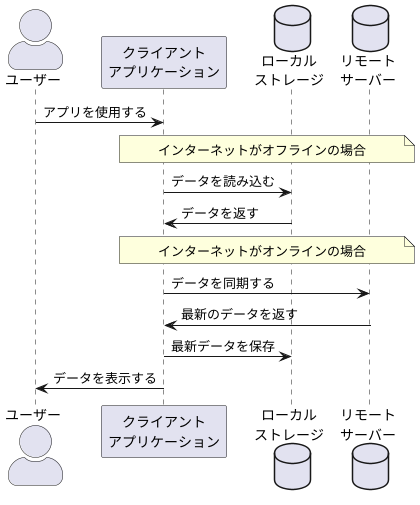

## 【Web】オフラインモードってどうなってるの？
1. サーバーから取得したデータをブラウザのローカルストレージに保存
2. オフラインでアクセスした場合はローカルストレージのデータを表示
3. 次回オンラインアクセス時に、ローカルストレージのデータを更新(同期)

- 最後にサーバーと通信した時点でのデータが利用可能。オフラインの間に他のユーザーやプロセスによってデータが更新されていても反映されない。
- オフラインではサーバーと通信できないため、POSTリクエスト（情報の更新）は行えない。

### memo
- LocalStorageのデータは`同一オリジン(ドメイン、プロトコル、ポート)`のページで共有される
- Cookieより容量が大きい

---

## 【AI】シーケンス図の作り方
- プロンプトに「シーケンス図をPlantUML形式で書いてください」と加えると生成してくれる
- https://www.plantuml.com/plantuml にコピペして確認する

生成される画像

 
